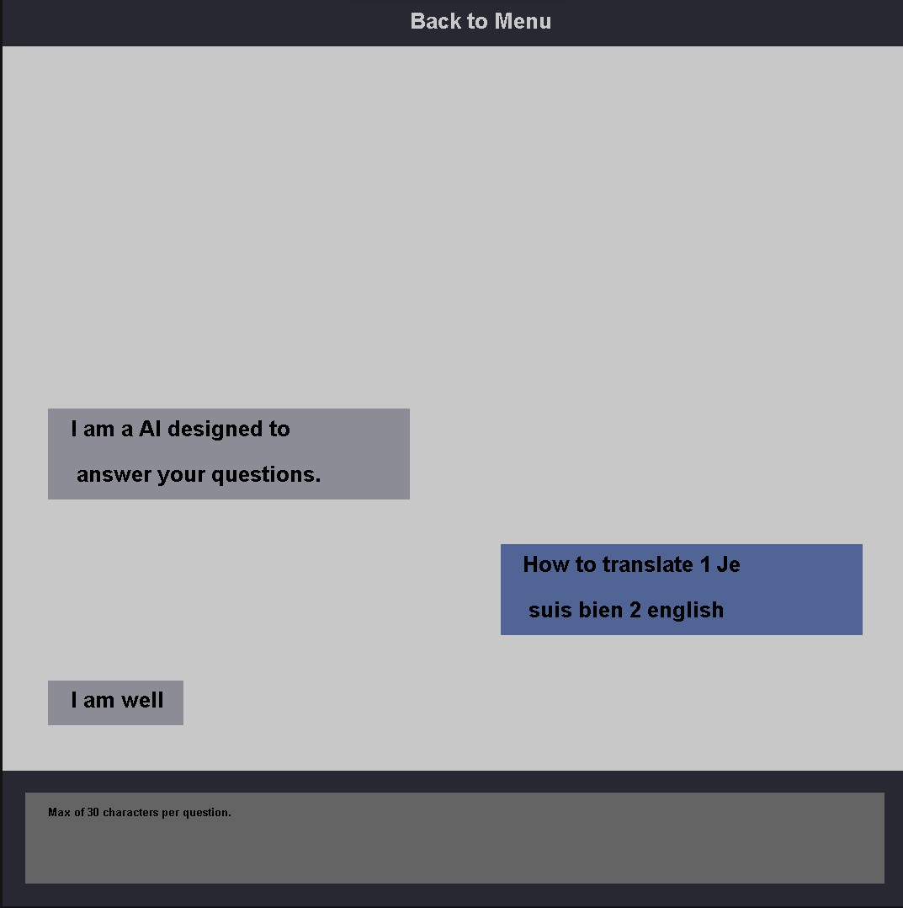
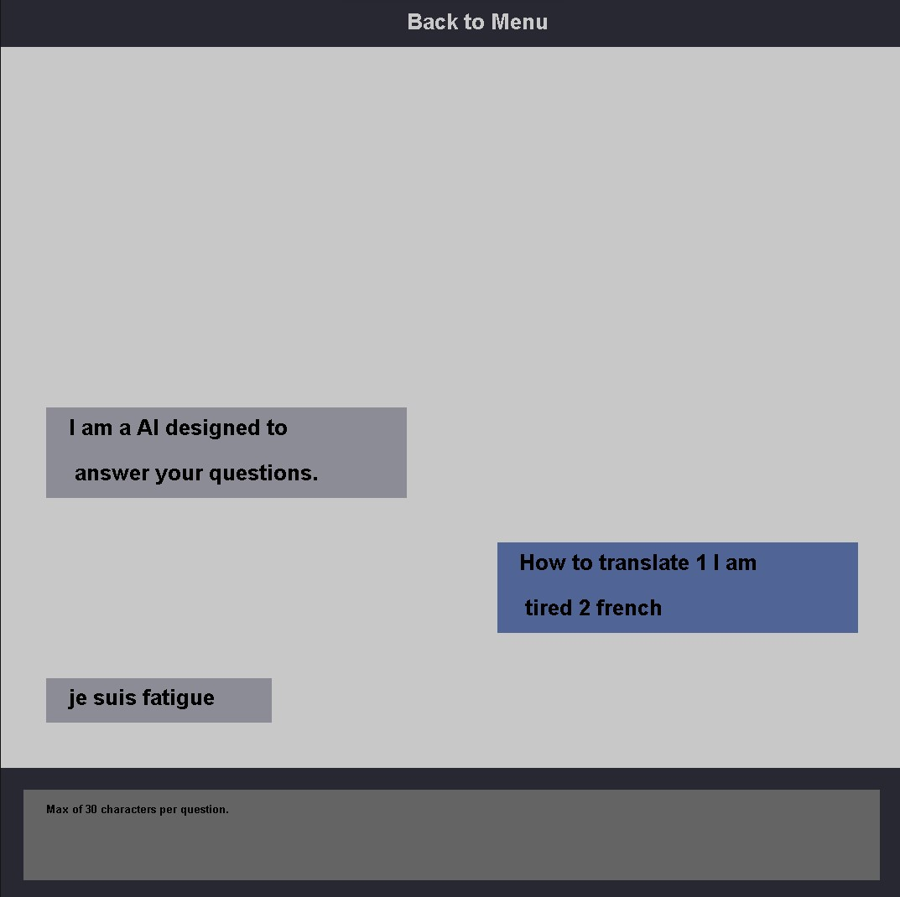
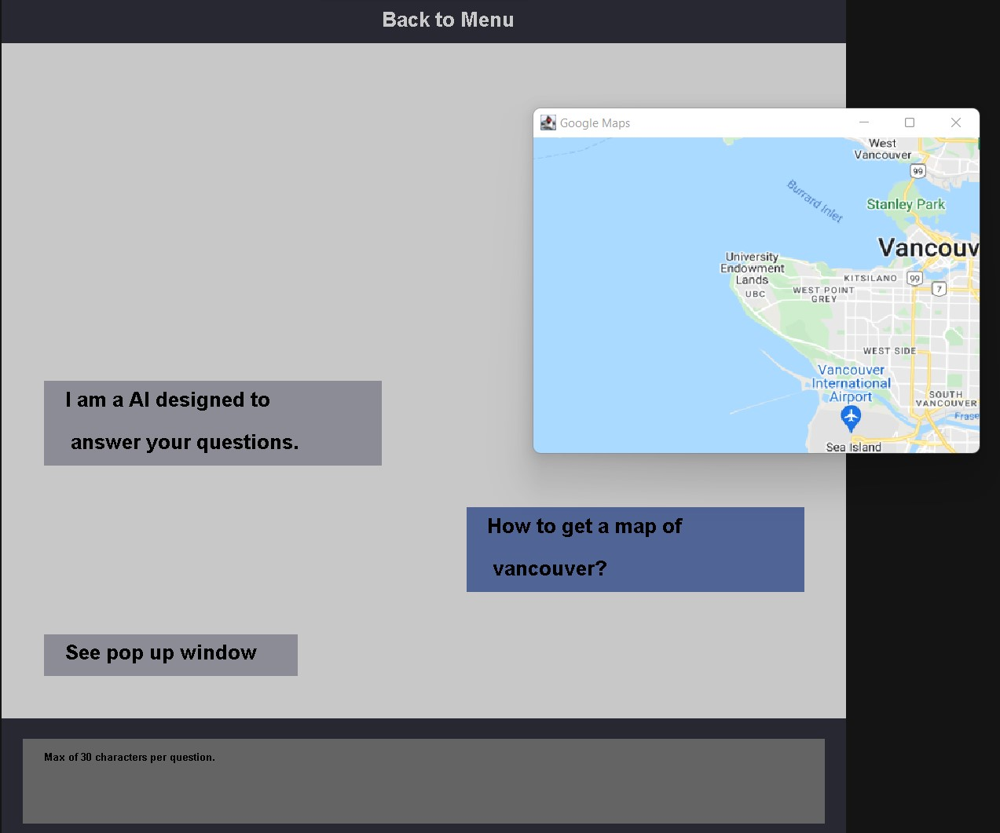
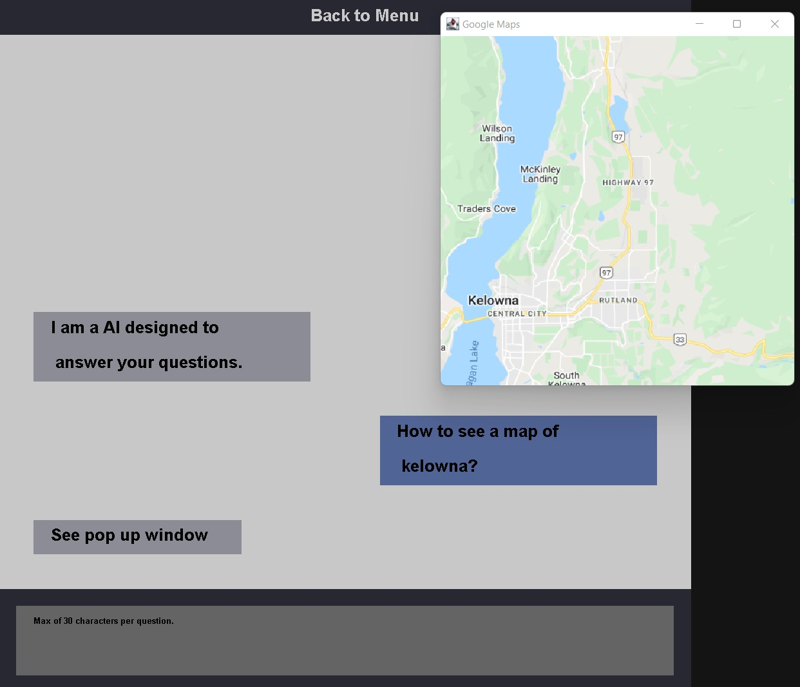

# Cosc310Group7
## Yeet the dishes chat bot
There is now a basic GUI that has a menu system as well as chat screen.
The chat bot also provides, in the console, data of messages sent.
The bot also translates to french for french-speaking Canadians. 
As well as provides a map for the local area. 
To be able to see all addresses, the geocoding API needs to be implemented. 

## External APIs
Google Statics Maps API: https://www.luv2code.com/2015/05/15/how-to-add-google-maps-to-java-swing-gui/
This lets us embed a Google Maps image on our chat bot without requiring JavaScript or any dynamic page loading

Google Translate API: https://github.com/goxr3plus/java-google-translator.git
This uses Google's neural machine translation technology to instantly translate texts into more than one hundred languages.

## GUI
The gui is fairly well formated and SHOULD work regardless of the display size.
The gui is full screened and does not have an option for windowed.
The gui does not allow the user to send messages with symbols(+, -, $, &...).
Only allows for 30 characters max.

## Data
This data uses the 3 toolkits we implemented.
The first toolkit tokenizes the messages.
The second toolkit adds tags and probabilities to the toolkits.
The third toolkit uses those tags and provides the LEMMA of each word.

## Example
If the user types "Where is my food?". The AI will provide a response in the GUI. 

The AI will also print out the following in the console:

Token	:	Tag	:	Probability
---------------------------------------------
where	:	WRB	:	0.854114026602201
is	:	VBZ	:	0.8976326825382562
my	:	PRP$	:	0.96331011384047
food	:	NN	:	0.9971238127402574
?	:	.	:	0.975736940559756

Printing lemmas for the given sentence...
WORD -POSTAG : LEMMA
where -WRB : where
is -VBZ : be
my -PRP$ : my
food -NN : food
? -. : O
